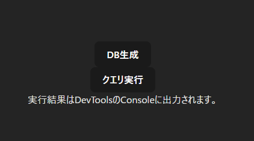
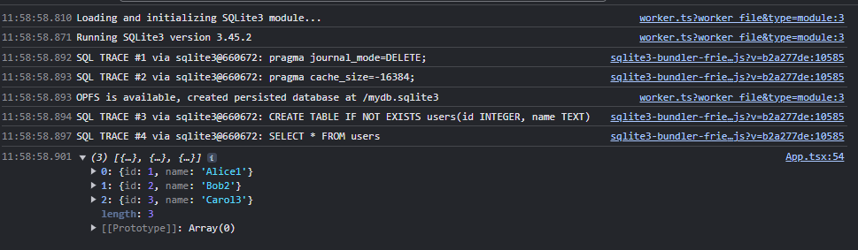
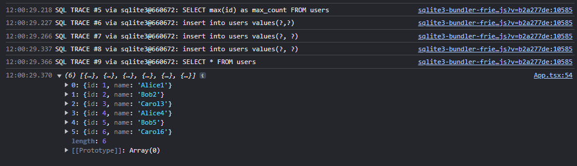

# ComlinkでWeb Workerを非同期関数として呼び出す(React+vite)

## はじめに

[ReactでSQLite Wasmを実行して、localStorageに永続化する最小のサンプル](https://github.com/murasuke/react_wasm_sqlite_step1)は、
メインスレッドで実行しているので、sqliteの読み込み時に警告が出てしまいます。

`Ignoring inability to install OPFS sqlite3_vfs: The OPFS sqlite3_vfs cannot run in the main thread because it requires Atomics.wait().`

※localStorageに保存しているのに関わらず、なぜ警告が出るのかは不明・・・

そこで、sqliteをWeb Worker側で実行するように変更して、[OPFS](https://developer.mozilla.org/ja/docs/Web/API/File_System_API/Origin_private_file_system)に永続化してみます。


### [Comlink](https://github.com/GoogleChromeLabs/comlink)とは

ComLinkは、Web Workerの呼び出しを簡単にしてくれるライブラリです。

ブラウザからWeb Workerの呼び出しは、postMessag()経由で行います。

* Web Worker側で実行する処理
```javascript:worker.js
self.onmessage = function(event) {
    var data = event.data;
    var result = data * 2; // ここで何らかの処理を行う
    self.postMessage(result);
};
```

* ブラウザからの呼び出し
```javascript
var worker = new Worker('worker.js');

worker.onmessage = function(event) {
    console.log(event.data); // Web Workerからの結果を表示
};

worker.postMessage(10); // Web Workerにデータを送信
```

これをComlinkで書き直すと以下のように、非同期関数として呼び出すことができるようになります。
```javascript:worker.js
importScripts('https://unpkg.com/comlink/dist/umd/comlink.js');

const api = {
  multiply: (num) => num * 2,
};

Comlink.expose(api);
```

* ブラウザからの呼び出し
```javascript
import * as Comlink from 'https://unpkg.com/comlink/dist/umd/comlink.js';

const worker = new Worker('worker.js');
const api = Comlink.wrap(worker);

const result = await api.multiply(10);
console.log(result); // 20
```

### DBファイルの保存先について
DBファイルは[OPFS(オリジンプライベートファイルシステム)](https://developer.mozilla.org/ja/docs/Web/API/File_System_API/Origin_private_file_system)という仮想的なファイルシステムに保存されます。SessionStorageとLocalStorageと異なり、GB単位のサイズを扱うことが可能です。

ブラウザのDevToolsからは操作ができないため、Chrome拡張の[OPFS explorer](https://chromewebstore.google.com/detail/opfs-explorer/acndjpgkpaclldomagafnognkcgjignd?pli=1)を入れておくと便利です（削除したい場合など）

## 作成手順

* 画面イメージ


### プロジェクト作成
* viteでReactプロジェクトを作成

```bash
$ npm create vite@latest react_wasm_sqlite_step2 -- --template react-ts
$ cd react_wasm_sqlite_step2
$ npm install
```

### sqliteをインストール
```bash
$ npm i @sqlite.org/sqlite-wasm
```

* `vite.config.ts`を修正

`headers`と`optimizeDeps`を追加します。
`Cross-Origin-Opener-Policy`と`Cross-Origin-Embedder-Policy`は、`SharedArrayBuffer`を利用するために必要な設定です(sqliteが内部的に利用)。

```typescript:vite.config.ts
import { defineConfig } from 'vite';
import react from '@vitejs/plugin-react';

// https://vitejs.dev/config/
export default defineConfig({
  plugins: [react()],
  server: {
    headers: {
      'Cross-Origin-Opener-Policy': 'same-origin',
      'Cross-Origin-Embedder-Policy': 'require-corp',
    },
  },
  optimizeDeps: {
    exclude: ['@sqlite.org/sqlite-wasm'],
  },
});
```

### Comlinkをインストール

* comlinkをインストールする
```bash
$ npm i comlink
$ npm i -D vite-plugin-comlink
```

* `vite.config.ts`の設定変更

`vite-plugin-comlink`をimportして、pluginを設定します

```diff
import { defineConfig } from 'vite';
import react from '@vitejs/plugin-react';
+ import { comlink } from 'vite-plugin-comlink';

// https://vitejs.dev/config/
export default defineConfig({
-  plugins: [react()],
+  plugins: [react(), comlink()],
  server: {
    headers: {
      'Cross-Origin-Opener-Policy': 'same-origin',
      'Cross-Origin-Embedder-Policy': 'require-corp',
    },
  },
  optimizeDeps: {
    exclude: ['@sqlite.org/sqlite-wasm'],
  },
+  worker: {
+    plugins: [comlink()],
+  },
});
```

* comlinkの型定義

型定義を利用するため、下記1行を追加します
```typescript:./src/vite-env.d.ts
/// <reference types="vite-plugin-comlink/client" />
```

### Web Worker

sqliteの処理のうち一部の機能をexportして、Comlink経由で呼び出し可能にします

* db接続(`connectDB()`)
* クエリ実行(`exec()`)
* select文で値を取得(`selectValue()`)

```typescript:./src/worker.ts
import sqlite3InitModule, {
  Database,
  Sqlite3Static,
  FlexibleString,
  PreparedStatement,
  BindingSpec,
} from '@sqlite.org/sqlite-wasm';

// 実行したクエリをコンソール出力するためのメソッド
const log = (...args: any[]) => console.log(...args); // eslint-disable-line
const error = (...args: any[]) => console.error(...args); // eslint-disable-line

let db: Database | null = null;

/**
 * DBの初期化と接続を行う
 * @returns Database
 */
export const connectDB = async (): Promise<Database> => {
  if (db) {
    return db;
  }

  log('Loading and initializing SQLite3 module...');

  try {
    // sqlite3の初期化
    const sqlite3 = await sqlite3InitModule({
      print: log,
      printErr: error,
    });

    // DBに接続
    db = openDB(sqlite3);

    return db;
  } catch (err: unknown) {
    if (err instanceof Error) {
      error(err.name, err.message);
      throw err;
    }
  }

  throw new Error('unknown error');
};

/**
 * sqlite3に接続してDBを作成
 * ・https://sqlite.org/wasm/doc/tip/api-oo1.md
 * @param sqlite3
 * @returns
 */
const openDB = (sqlite3: Sqlite3Static) => {
  log('Running SQLite3 version', sqlite3.version.libVersion);

  // opfsが利用可能であればOpfsDbを生成する
  if ('opfs' in sqlite3) {
    // (c: create if it does not exist, t: trace on)
    db = new sqlite3.oo1.OpfsDb('/mydb.sqlite3', 'ct');
    log('OPFS is available, created persisted database at', db.filename);
  } else {
    db = new sqlite3.oo1.DB('/mydb.sqlite3', 'ct');
    log('OPFS is not available, created transient database', db.filename);
  }

  return db;
};

/**
 * execのラッパー
 * @param sql
 * @param opts
 * @returns
 */
// eslint-disable-next-line @typescript-eslint/no-explicit-any
export const exec = (sql: any, opts: any = {}): Database => {
  if (!db) {
    throw new Error();
  }

  if ('string' === typeof sql) {
    return db.exec(sql, opts);
  } else {
    return db.exec(sql);
  }
};

/**
 * select文で値を取得
 * @param sql
 * @param bind
 * @param asType
 * @returns
 */
export const selectValue = (
  sql: FlexibleString,
  bind?: BindingSpec, // eslint-disable-next-line @typescript-eslint/no-explicit-any
  asType?: any
): unknown => {
  if (!db) {
    throw new Error();
  }

  return db.selectValue(sql, bind, asType);
};
```

#### プリペアードステートメントについて

 `Database::prepare()`は`PreparedStatement`を返しますが、メインUIスレッド側に渡せません
 (プロパティーの値はシリアライズされるので渡されるが、UIスレッドからメソッド呼び出しができない)

 そのため、`PreparedStatement`を`objectStore`に保持し、メインUIスレッド側には値を取得するためのキー(pointer)を返すようにします


* 利用サンプル
```javascript
// PreparedStatementのキー(handle)を取得
const handle = await worker.prepare('insert into users values(?, ?)');
// PreparedStatementのメソッドを呼び出す代わりに、handle経由で呼び出す
await worker.binding(handle, [1, `Alice`]);
await worker.stepFinalize(handle);
```

* `worker.ts`の続き
```typescript:./src/worker.ts
// 前半は省略

/**
 * Database::prepare()はStatementを返しますが、メインUIスレッド側に渡せません
 * (値はシリアライズされて渡されるが、UIスレッドからメソッド呼び出しができない)
 * そのため、StatementをobjectStoreに保持して、
 * メインUIスレッド側には、値を取得するためのキー(pointer)を返します
 */
const objectStore: {
  [key: number]: object;
} = {};

/**
 * prepareのラッパー
 * ・objectStoreの説明参照
 * @param sql
 * @returns
 */
export const prepare = (sql: FlexibleString): number => {
  if (!db) {
    throw new Error();
  }
  const stmt = db.prepare(sql);
  const handle = stmt.pointer as number;
  objectStore[handle] = stmt;
  return handle;
};

/**
 * PreparedStatement::bind()のラッパー
 * (javascriptのbindとメソッド名が被るのでbindingに変更)
 * @param handle
 * @param binding
 * @returns
 */
export const binding = (handle: number, binding: BindingSpec): number => {
  if (!db) {
    throw new Error();
  }

  const stmt = objectStore[handle] as PreparedStatement;
  stmt.bind(binding);
  return handle;
};


/**
 * PreparedStatement::stepFinalize()のラッパー
 * @param handle
 * @returns
 */
export const stepFinalize = (handle: number): boolean => {
  if (!db) {
    throw new Error();
  }

  const stmt = objectStore[handle] as PreparedStatement;
  return stmt.stepFinalize();
};

```

### ReactからComlink経由でDB処理を呼び出す

* ボタンクリックでDB接続とクエリ実行の処理を呼び出す
* 実行したクエリはコンソールに表示される

```typescript:./src/App.tsx
import './App.css';

const worker = new ComlinkWorker<typeof import('./worker')>(
  new URL('./worker', import.meta.url)
);

function App() {
  // comlink(web worker)による非同期処理。
  const connectDB = async () => {
    await worker.connectDB();
    // テーブル作成
    await worker.exec(
      'CREATE TABLE IF NOT EXISTS users(id INTEGER, name TEXT)'
    );

    // データ出力
    dumpUsers();
  };

  const execute = async () => {
    const select_max = 'SELECT max(id) as max_count FROM users';
    const max = ((await worker.selectValue(select_max)) as number) ?? 0;

    // 行追加(exec)
    await worker.exec({
      sql: 'insert into users values(?,?)',
      bind: [max + 1, `Alice${max + 1}`],
    });

    // 行追加(prepare & bind)
    // worker側からPreparedStatementを返してもメソッドを呼べないため、
    // 値自体はWeb Worker側で保持して、キー(handle)経由で操作する
    const handle1 = await worker.prepare('insert into users values(?, ?)');
    const handle2 = await worker.prepare('insert into users values(?, ?)');

    await worker.binding(handle1, [max + 2, `Bob${max + 2}`]);
    await worker.binding(handle2, [max + 3, `Carol${max + 3}`]);

    await worker.stepFinalize(handle1);
    await worker.stepFinalize(handle2);

    // データ出力
    dumpUsers();
  };

  const dumpUsers = async () => {
    const values = await worker.exec({
      sql: 'SELECT * FROM users',
      rowMode: 'object',
      returnValue: 'resultRows',
    });

    console.log(values);
  };

  return (
    <div>
      <button onClick={() => connectDB()}>DB生成</button>
      <br />
      <button onClick={() => execute()}>クエリ実行</button>
      <div className="return">実行結果はDevToolsのConsoleに出力されます。</div>
    </div>
  );
}

export default App;


```


## 動作確認

```bash
$ npm run dev

  VITE v5.1.5  ready in 191 ms

  ➜  Local:   http://localhost:5173/
  ➜  Network: use --host to expose
  ➜  press h + enter to show help
```
* `DB生成`ボタンをクリック
  * sqliteのロードと、テーブル作成が行われます
  * 永続化されているため、前回のデータ(3レコード)が残っていることが確認できます


  


* `クエリ実行`
  * `insert`を3回実行して、データが3行追加されたことがわかります

  


## 参考

https://www.npmjs.com/package/vite-plugin-comlink

https://dev.to/franciscomendes10866/how-to-use-service-workers-with-react-17p2
